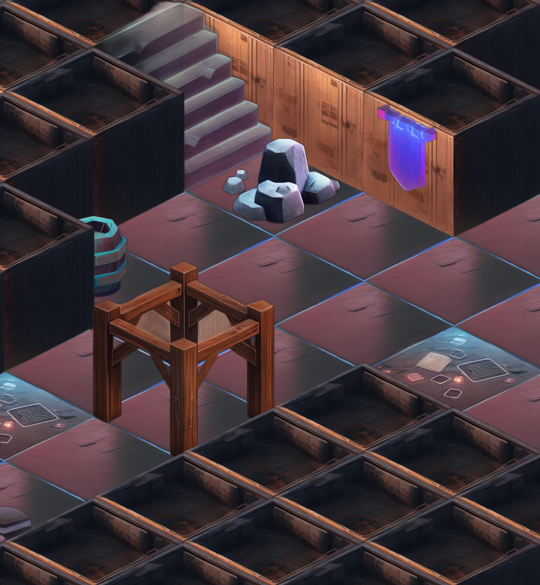
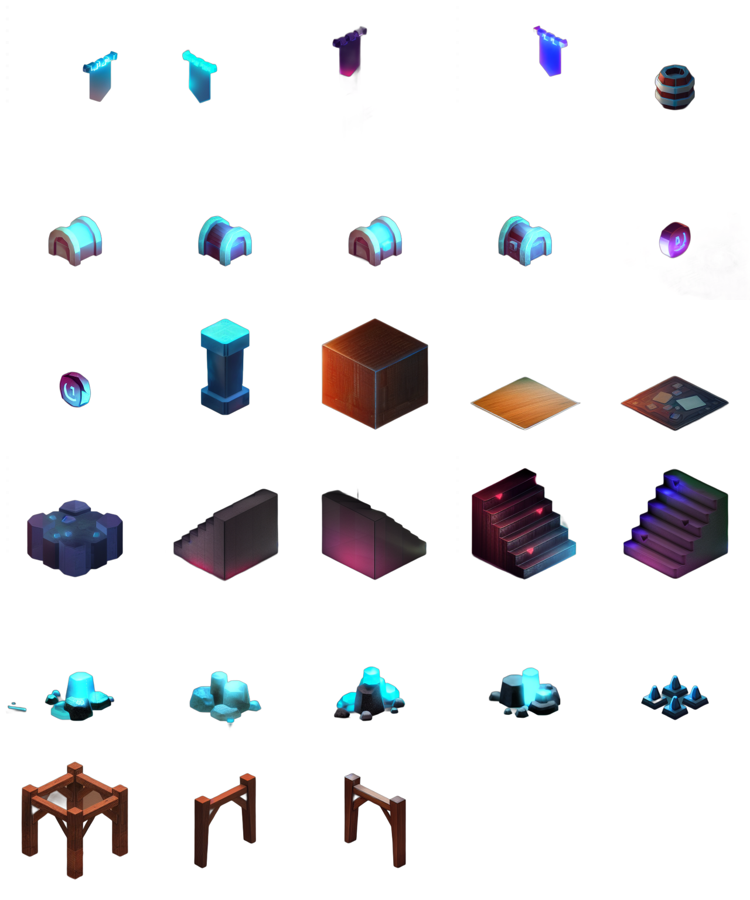
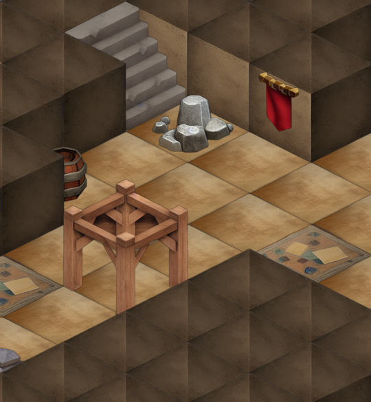
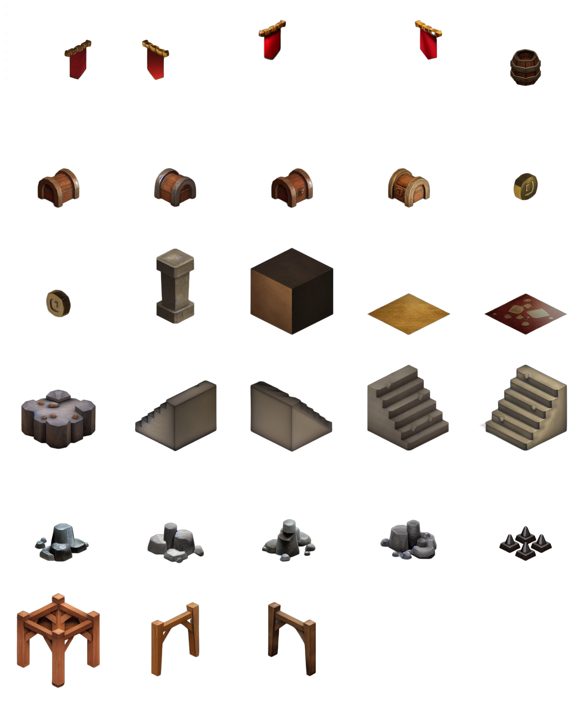

# Gallery

This is a preview of the levels and tilesets present in the showcase.

## Base level and tileset

  
Click me

Assets are from [Kenney](https://www.kenney.nl/), licensed under [CC0](https://creativecommons.org/publicdomain/zero/1.0/).

 

## OpenJourney v4 Cyberpunk DDIM

  
Click me

  
 

## Stable Diffusion 1.5 Cyberpunk DDIM

  
Click me

  

## Stable Diffusion 1.5 Cyberpunk Euler

  
Click me

  

## OpenJourney v4 Medieval DDIM

  
Click me

  

## Stable Diffusion 1.5 Medieval DDIM

  
Click me

  

## Stable Diffusion 1.5 Medieval Euler

  
Click me

  

