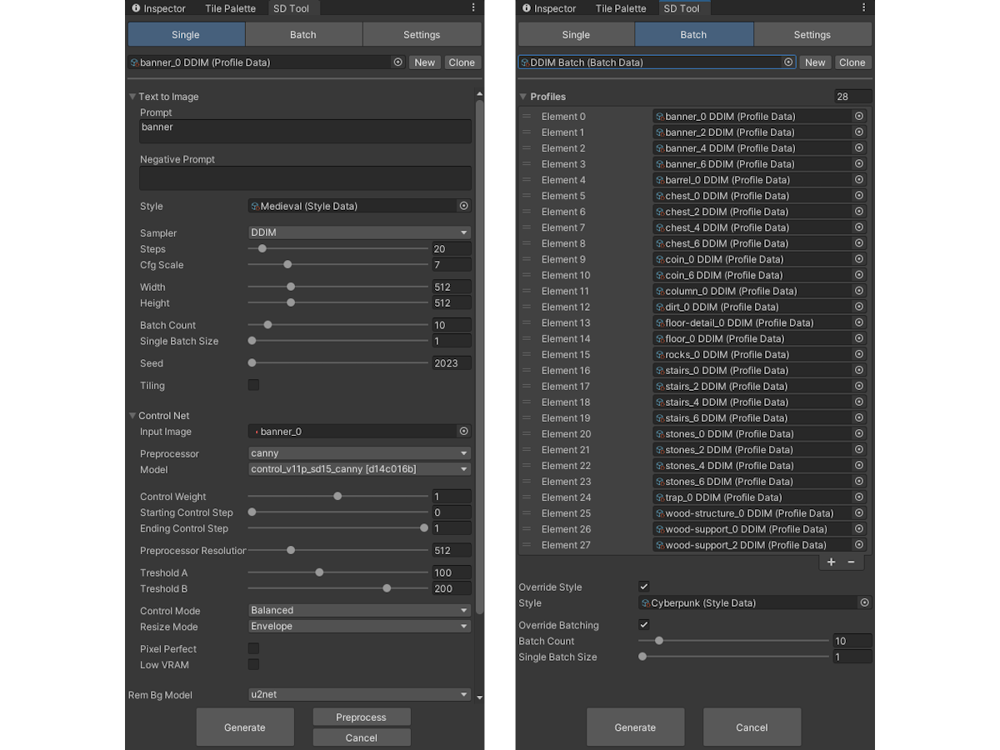

# Stable Diffusion Tool for Unity

## About

This repository contains a prototype of a tool for Unity Editor that uses **generative machine learning** to automate in-editor 2D asset creation with **text-to-image** [Stable Diffusion 1.5](https://arxiv.org/abs/2112.10752) model with [ControlNet](https://arxiv.org/abs/2302.05543) and [U^2-Net](https://arxiv.org/abs/2005.09007). It was made as a part of my computer science master's degree thesis ["Application of machine learning methods for content generation in computer games"](https://www.ap.uj.edu.pl/diplomas/167526). The tool is made of two modules, **SD Tool** and **SD Web UI API Client**. The first one provides an **in-editor GUI** to change settings, save them, run the model and run some **automations**. The second one implements a **client** module (**C# integration**) for [AUTOMATIC1111's Stable Diffusion Web UI](https://github.com/AUTOMATIC1111/stable-diffusion-webui) API to use it easily with **Unity Engine** and **Editor**. The Web UI handles the generation process, and it can run locally on the consumer grade GPUs.

These modules are distributed as UPM packages. You can download them from the releases, as well as an interactive showcase.

You can preview the generated assets used in the showcase [here](./Media/GALLERY.md).

## Features

SD Tool:
 - Use *Stable Diffusion* and change inference settings;
 - Use *ControlNet*, change settings, and preview preprocessor settings;
 - Use *U^2-Net* to remove background and add transparency;
 - Save settings in profiles (Scriptable Objects);
 - Generate single asset or multiple variations;
 - Save generated images as sprites;
 - Auto-save all generated results;
 - Styles - injected partial prompts;
 - Override styles and batch counts;
 - Create and run batches (of profiles) with overrides;
 - Connect to local or remote *Stable Diffusion Web UI* through REST API.

SD Web UI API Client:
 - Provides wrapper for `HttpClient` to easily connect with *Web UI*;
 - C# compatible data models for most important endpoints;
 - Type conversion from `Base64` to `Texture2D` format;
 - Generic data processors for `GET` and `POST` requests;
 - Can run in runtime;

*The tool is a prototype made for master's thesis, and it is not suited for professional use.*

## Installation & Usage

- Download the `Stable Diffusion Tool.zip` file;
- Unzip it in the `Packages` directory in the Unity project directory;
- Check if the *SD Tool* and *SD Web UI API Client* are installed in the *Package Manager* window;
- Install and run *Stable Diffusion Web UI* with:
    - `--api` arg (and optionally `--api-log`);
    - `sd-webui-controlnet` extension and *Canny* model installed;
    - `stable-diffusion-webui-rembg` extension installed.
- Open *SD Tool* window from *Tools* menu;
- Set the *Server Address* in the *Settings* tab or leave localhost;
- Create a new profile in the *Single* tab;
- Change properties e.g., prompt, and press *Generate*;
- You can run multiple profiles at once by creating a batch in the *Batch* tab.

*The tool has been tested with Stable Diffusion Web UI 1.3, Stable Diffusion 1.5, and ControlNet v1.1.207 with Canny method.*

## Tools & Dependencies

 - [Unity 2021.3.23](https://unity.com/releases/editor/whats-new/2021.3.23) - game engine/editor;
 - [Newtonsoft.Json](https://www.newtonsoft.com/json) - for data serializing and conversions;
 - [Stable Diffusion Web UI 1.3](https://github.com/AUTOMATIC1111/stable-diffusion-webui/releases/tag/v1.3.0) - management system and server for Stable Diffusion;
 - [sd-webui-controlnet](https://github.com/Mikubill/sd-webui-controlnet) - extension providing ControlNet support;
 - [control_v11p_sd15_canny](https://huggingface.co/lllyasviel/ControlNet-v1-1/tree/main) - model for Canny method;
 - [stable-diffusion-webui-rembg](https://github.com/AUTOMATIC1111/stable-diffusion-webui-rembg) - extension providing U^2-Net model support to remove background.

## Credits

 - **Michał Biernat** @[m-biernat](https://github.com/m-biernat)

## License

All rights reserved ([no license](https://choosealicense.com/no-permission/)): 
 - You **can** view (peek into the code and assets) and fork this repository;
 - You **cannot** reproduce, distribute, or create derivative works;
 - You **can** use the tool (*"SD Tool" and "SD Web UI API Client"*) in your projects free of charge.
 - You **can** use the interactive showcase free of charge.
